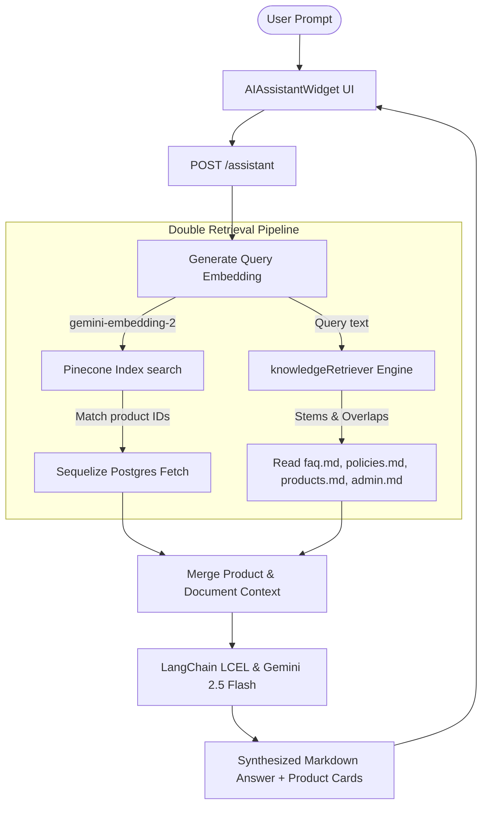

# GENTWear - Premium Menswear E-Commerce Platform

GENTWear is a state-of-the-art e-commerce application tailored for premium menswear. It features a complete shopping experience, Stripe payment flows, administrative analytics dashboards, and custom computer science algorithms implementing autocomplete, recommendation systems, in-memory caching, inventory heap auditing, and a hybrid Retrieval-Augmented Generation (RAG) AI assistant.

---

## 🏗️ Technical Architecture & Technology Stack

The platform is split into a client-server architecture:

### 1. Frontend Client (`/frontend/frontend`)
*   **Core:** React 19 (TypeScript), Vite
*   **Styling & Animations:** Tailwind CSS v4, Framer Motion, GreenSock (GSAP)
*   **State Management:** Redux Toolkit & Zustand (for lightweight local stores)
*   **Payments:** Stripe React SDK (`@stripe/stripe-js`)
*   **Icons:** Lucide React

### 2. Backend API Server (`/backend`)
*   **Runtime:** Node.js, Express
*   **Database:** PostgreSQL managed via Sequelize ORM
*   **Caching & Queue:** Redis (with local LRU fallback client)
*   **Mailing:** Nodemailer SMTP client
*   **AI SDKs:** Google Generative AI SDK (`@google/generative-ai`), LangChain LCEL (`@langchain/core`)
*   **Vector Engine:** Pinecone DB (`@pinecone-database/pinecone`)

---

## 🤖 The RAG (Retrieval-Augmented Generation) System

The GENTWear AI Shopping Assistant provides interactive customer support, answers policy questions, and recommends clothing styles from our database. It is implemented in [aiService.js](file:///d:/GENTWear/backend/src/services/aiService.js) and [knowledgeRetriever.js](file:///d:/GENTWear/backend/src/rag/knowledgeRetriever.js).



### 1. The Double Retrieval Pipeline
When a user submits a question to the chat widget, the backend triggers two independent retrieval flows in parallel:

*   **Vector Database Retrieval (Product Inventory):**
    *   Converts the user's query into a 1536-dimensional unit vector using the `gemini-embedding-2` model.
    *   Queries the Pinecone index `gentwear-products` for the top 3 most similar products.
    *   Retrieves their active database records (including pricing, images, and variants) from the PostgreSQL database.
*   **Local Document Keyword Retrieval (`knowledgeRetriever.js`):**
    *   Parses the unstructured Markdown files inside [backend/knowledge/](file:///d:/GENTWear/backend/knowledge) (`faq.md`, `policies.md`, `products.md`, and `admin.md`) by splitting them at secondary header delimiters (`##`).
    *   Applies a tokenizer that filters out common English stopwords (e.g., *the, and, for, with*).
    *   Normalizes and stems tokens (e.g., stripping suffixes like `-ing`, `-ments`, `-s`, `-ed`, `-ly`) using a rule-based stemmer.
    *   Calculates a weighted keyword overlap similarity score:
        *   **Direct match in Section Title:** `+5` points.
        *   **Direct match in Document Title:** `+2` points.
        *   **Match in Section Body:** `+1` point.
    *   Sorts matching sections descending by score and returns the top 2 sections.

### 2. Prompt Synthesis & LangChain Orchestration
Using LangChain's Expression Language (LCEL), the inputs are piped through a three-stage `RunnableSequence`:
1.  **Vectorization:** Vectorizes user queries.
2.  **Retrieval:** Searches Pinecone and retrieves markdown document sections.
3.  **LLM Ingestion:** Merges the retrieved products list and policy contents into a dense context window.

The final system instruction ensures responses stay professional and truthful:
```text
You are GENTWear's premium AI Shopping Assistant. Your goal is to guide clients on products, sizing, styling, returns, shipping, admin rules, and general store FAQs.
Keep responses concise, elegant, and helpful. Use markdown.
Use the provided store knowledge and policies context to answer general questions. Do not invent information not found in the context.
```
This is sent to `gemini-2.5-flash` to synthesize a natural markdown reply, which is returned along with structured product metadata.

### 3. AI Sandbox Mode (Zero Dependency Fallback)
If credentials for Pinecone or Gemini are missing or contain placeholder values in the `.env` configuration, the system automatically enables **AI Sandbox Mode**:
*   **Mock Embeddings:** Computes deterministic unit vectors locally based on string hashing algorithms.
*   **Heuristic Local Search:** Calculates cosine similarity against a local vector cache map of database products.
*   **Direct Knowledge Fallback:** Routes matches to the relevant local knowledge file content and formats the response using local logic, preventing any crashes or API timeouts during local development.

---

## 🧮 Custom Algorithmic Suites

GENTWear contains several custom-engineered computer science algorithms in the backend and frontend:

### 1. Collaborative Filtering Recommendation Engine (`CollaborativeFiltering.js`)
Located in [CollaborativeFiltering.js](file:///d:/GENTWear/backend/src/algorithms/CollaborativeFiltering.js), this algorithm serves personalized recommendations to logged-in customers using a User-Based K-Nearest Neighbors (KNN) model:
*   **Interaction Matrix Construction:** Aggregates database records to build a sparse User-Item matrix:
    *   *Paid Order Purchases:* Score weight of `3.0`.
    *   *Submitted Review Ratings:* Score weight equal to the user's numeric rating (`1.0` to `5.0`).
    *   *Wishlist Item Additions:* Score weight of `2.0`.
*   **Cosine Similarity Matching:** Measures the cosine angle between the sparse preference vectors of the target user ($A$) and other users ($B$):
    $$\text{Similarity}(A, B) = \frac{A \cdot B}{\|A\| \|B\|}$$
*   **KNN & Score Prediction:** Extracts the top $K = 5$ closest neighbors, aggregates their interactions, filters out items the target user has already purchased/wishlisted, and returns the top recommended products.
*   **Cold-Start Fallback:** Automatically falls back to popular/featured menswear items if no user history exists.

### 2. Autocomplete Search Trie (`Trie.js` & `Trie.ts`)
To power the fast search bar suggestions, a Trie (Prefix Tree) data structure is implemented in both:
*   Backend: [Trie.js](file:///d:/GENTWear/backend/src/algorithms/Trie.js) (Seeds with active product names on boot to serve `/products/autocomplete`).
*   Frontend: [Trie.ts](file:///d:/GENTWear/frontend/frontend/algorithms/Trie.ts).

As characters are typed, the prefix tree traverses children nodes in $O(L)$ time (where $L$ is query length) and performs depth-first searches to return up to 10 autocomplete matches.

### 3. Inventory Low-Stock Audit Heap (`MinHeap.js`)
An automated audit job runs in the background of [Index.js](file:///d:/GENTWear/backend/src/Index.js#L100-L140) using a custom Min-Heap implementation ([MinHeap.js](file:///d:/GENTWear/backend/src/algorithms/MinHeap.js)):
*   Runs on server boot and every **1 hour** thereafter.
*   Pushes all product size/color variants into the Min-Heap.
*   Extracts variants ordered by `stock_qty` ascending.
*   If a variant's quantity is **under 10**, it logs a low-stock alert warning.
*   The traversal breaks early the moment it encounters a variant with $\ge 10$ items, guaranteeing optimal $O(K \log N)$ runtimes for finding the $K$ low-stock items.

### 4. Least-Recently-Used Fallback Cache (`LRUCache.js`)
For performance optimization, product details are cached. If the Redis server connection fails or is offline:
*   The database fallback layer in [redis.js](file:///d:/GENTWear/backend/src/config/redis.js) instantiates a local [LRUCache.js](file:///d:/GENTWear/backend/src/algorithms/LRUCache.js) instance bounded to 50 items.
*   Implements node swapping inside a doubly linked list structure to evict the least-recently-used product specifications when capacity is reached.

---

## 📂 Project Directory Structure

```text
GENTWear
├── backend
│   ├── knowledge           # Markdown documents faq, policies, products, admin
│   └── src
│       ├── Index.js        # Main Express server entry & low-stock cron heap
│       ├── algorithms      # MinHeap, Trie, LRUCache, CollaborativeFiltering
│       ├── config          # DB Connection, Redis config, Pinecone setup
│       ├── controllers     # API handling layers
│       ├── jobs            # Scheduling scripts
│       ├── middleware      # auth and admin guards
│       ├── migration       # Sequelize DB schemas
│       ├── models          # Sequelize schema entities (Product, Variant, User, etc)
│       ├── rag             # knowledgeRetriever engine
│       ├── routes          # Express endpoints (auth, products, assistant, reviews)
│       ├── seeders         # Seed data insertion scripts
│       └── services        # AI Vectorization and upload operations
│
└── frontend
    └── frontend
        ├── algorithms      # Frontend Trie autocomplete & quickSort
        ├── components      # Common UI elements, AIAssistantWidget, CartDrawer
        ├── pages           # ProductList, Detail, Wishlist, Checkout, Login
        │   └── admin       # Banners, Dashboard, Customers, Reviews, Orders
        └── src
            ├── App.tsx     # Client routes mapping
            └── main.tsx    # React virtual DOM setup
```

---

## ⚙️ Environment Variables Configuration

Create a file named `.env` in the `backend/src/` folder:

```env
PORT=5000
DB_HOST=localhost
DB_USER=postgres
DB_PASS=your_postgres_password
DB_NAME=gentwear

JWT_SECRET=your_jwt_access_token_secret
JWT_REFRESH_SECRET=your_jwt_refresh_token_secret

STRIPE_SECRET_KEY=sk_test_...

# RAG & AI Configuration
PINECONE_API_KEY=pcsk_...
PINECONE_INDEX_NAME=gentwear-products
GEMINI_API_KEY=your_gemini_api_key_here

# SMTP / Email Configuration
SMTP_HOST=smtp.gmail.com
SMTP_PORT=587
SMTP_USER=you@gmail.com
SMTP_PASS=your_gmail_app_password

APP_URL=http://localhost:5000
```

---

## 🚀 Getting Started

Follow these steps to run the development build locally.

### Prerequisites
*   Node.js (v18+)
*   PostgreSQL
*   Redis server (optional; will fall back to LRU Cache memory client if not running)

### Step 1: Database Setup
1. Create a database in PostgreSQL named `gentwear`.
2. Update your credentials in the backend `.env` file.

### Step 2: Initialize Backend Server
1. Navigate to the backend directory:
   ```bash
   cd backend
   ```
2. Install dependencies:
   ```bash
   npm install
   ```
3. Run database migrations:
   ```bash
   npx sequelize-cli db:migrate
   ```
4. Seed mock products and configurations:
   ```bash
   npx sequelize-cli db:seed:all
   ```
5. Run the server in development mode:
   ```bash
   npm run dev
   ```
   *The server will start listening at `http://localhost:5000`.*

### Step 3: Initialize Frontend Client
1. Navigate to the frontend directory:
   ```bash
   cd frontend/frontend
   ```
2. Install dependencies:
   ```bash
   npm install
   ```
3. Start the Vite development server:
   ```bash
   npm run dev
   ```
   *The client will start running at `http://localhost:5173`.*

---

## 🔗 Code Links & References

*   **RAG Engine:**
    *   RAG Data Retriever: [knowledgeRetriever.js](file:///d:/GENTWear/backend/src/rag/knowledgeRetriever.js)
    *   Gemini & Pinecone AI Service: [aiService.js](file:///d:/GENTWear/backend/src/services/aiService.js)
    *   Assistant Route Handler: [assistant.js](file:///d:/GENTWear/backend/src/routes/assistant.js)
    *   Frontend Chat Widget: [AIAssistantWidget.tsx](file:///d:/GENTWear/frontend/frontend/components/AIAssistantWidget.tsx)
*   **Algorithmic Implementations:**
    *   KNN Collaborative Filtering: [CollaborativeFiltering.js](file:///d:/GENTWear/backend/src/algorithms/CollaborativeFiltering.js)
    *   Search Suggestion Trie: [Trie.js](file:///d:/GENTWear/backend/src/algorithms/Trie.js) / [Trie.ts](file:///d:/GENTWear/frontend/frontend/algorithms/Trie.ts)
    *   Inventory Min-Heap: [MinHeap.js](file:///d:/GENTWear/backend/src/algorithms/MinHeap.js)
    *   Least-Recently-Used Cache: [LRUCache.js](file:///d:/GENTWear/backend/src/algorithms/LRUCache.js)
*   **Database Config:**
    *   Sequelize ORM Initialization: [db.js](file:///d:/GENTWear/backend/src/config/db.js)
